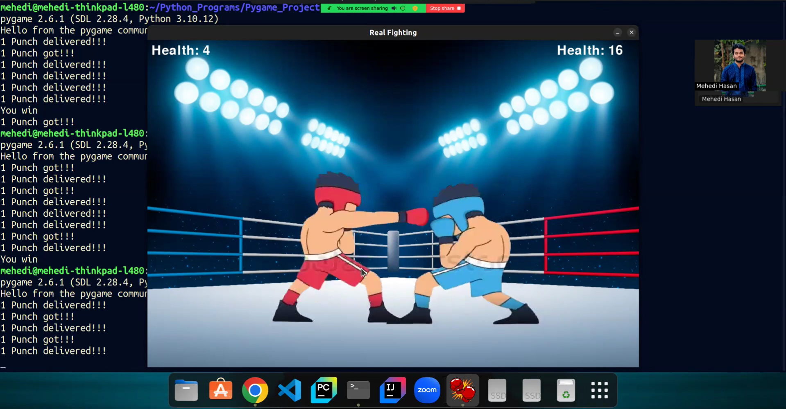

# 🥊 Pygame Project: Boxing Fight

**Developer🙋‍♂️**: [Mehedi Hasan](https://github.com/mh-MeHeDii)

A basic boxing fighting match between compuuter vs gamer/user. Both have some hp and user can punch the face of opponent👊. 

---

## 📜 About the Project

This project is a basic fighting. You have to come near to the opponent for punching. Opponent is a champion so he don't move from his position. After coming near, user have to hit a punch by pressing space button. After the end of hp between anyone, the game ends.

---

## 🎮 Features

- **Single-player gameplay**: Enjoy a classic offline game mode where you control a boxer and punching.
- **Sound System**: There is a beautiful sound system while running game, punching to opponent and opponents tear.
- **Life Display**: See the remaining hp of opponent and gamer.
- **Offline Play**: No internet connection required.

---

## 🖼️ Screenshots

### Gameplay


---

## 🛠️ Tools, Technologies, and Frameworks Used

- **Python Programming Language**: Handles core game logic and functionality.
- **Pygame Library**: Powers graphics and input handling.

---

## 🚀 How to Run the Game

1. **Install Pygame and Dependencies**: Ensure Python3, Pygame are installed on your system.
2. **Run Code**: Use the following code in terminal. For example:
   ```sh
   python3 main.py
